# Refined Storage → Applied Energistics 2 移行ガイド

## RS: 最小構成
Refined Storageでアイテムの出し入れができる倉庫を作成するためには、以下のアイテムが必要です:

コントローラー

エネルギーを受け取り、接続された機械を管理します。ネットワーク内に1つだけ設置する必要があります。

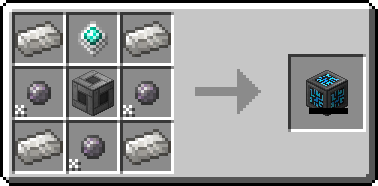

グリッド

ネットワーク内のアイテムの出し入れができます。

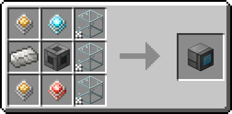

ストレージブロック

1千ストレージブロックでは、任意のアイテムを1000個まで保管できます。
空のストレージブロックを`Shift`+`右クリック`して、ストレージパーツを取り外せます。

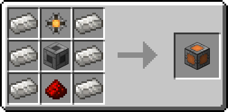

また、コントローラーへエネルギーを供給する必要がありますが、Refined Storageに発電機はありません。
MekanismやPowah!などの発電機を使用してください。

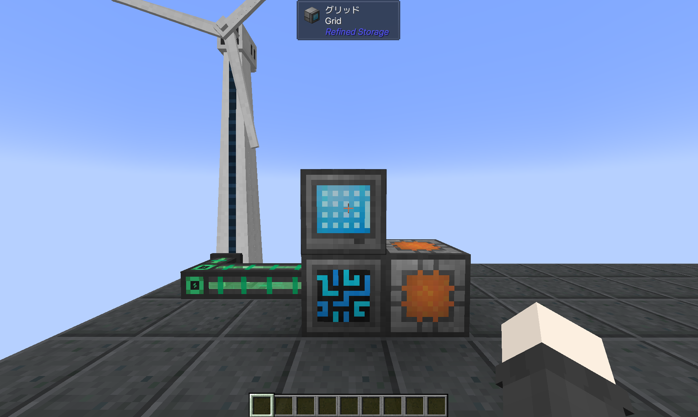

スペースを節約したい場合は、次のアイテムで代用できます:

携帯グリッド

持ち運び・設置共に可能なグリッドです。ストレージディスクを挿入する必要があります。

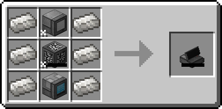

## AE2: 最小構成
Applied Energistics 2で同様の構成を作成するには、以下のアイテムが必要です:

MEチェスト

側面からストレージセルを挿入すると、上面のターミナル部からアイテムを出し入れできます。

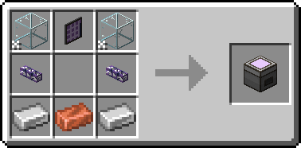

MEアイテムストレージセル

1k MEアイテムストレージセルでは、4160個-8128個のアイテムを、最大63種保管できます。

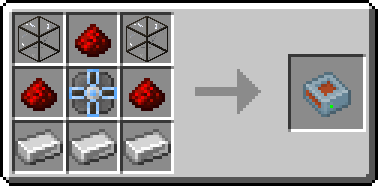

Crystal Resonance Generator (任意)

設置すると20AE/t=40RF/tのエネルギーを供給します。エネルギーが不足する場合は、火力発電機を使用するか、他MODの発電機を接続してください。

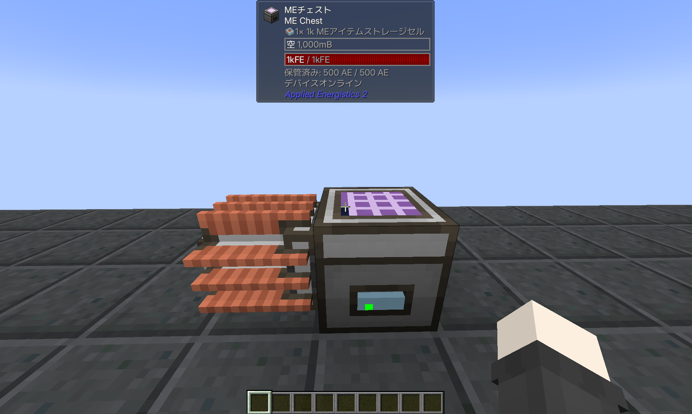

## RS: 複数のディスクを管理する

ストレージブロックを以下のアイテムで置き換えてください:

ストレージディスク

ストレージブロックと同様に、アイテムを保管できます。ディスクドライブに挿入することで機能します。

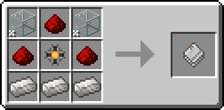

ディスクドライブ

ストレージディスクを最大8枚挿入できます。

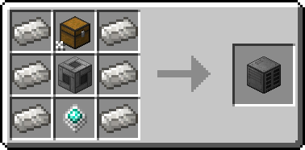

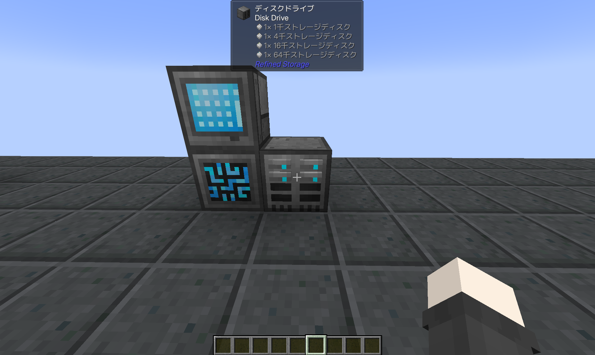

## AE2: 複数のセルを管理する

MEチェストを以下のアイテムで置き換えてください:

MEドライブ

MEアイテムストレージセルを最大10枚挿入できます。

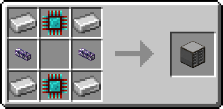

フルーシュのMEガラスケーブル

MEネットワークにおけるケーブルの役割を果たします。

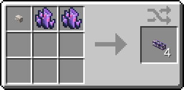

MEターミナル

MEネットワーク内のアイテムの出し入れができます。

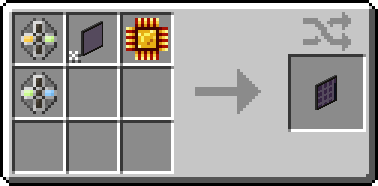

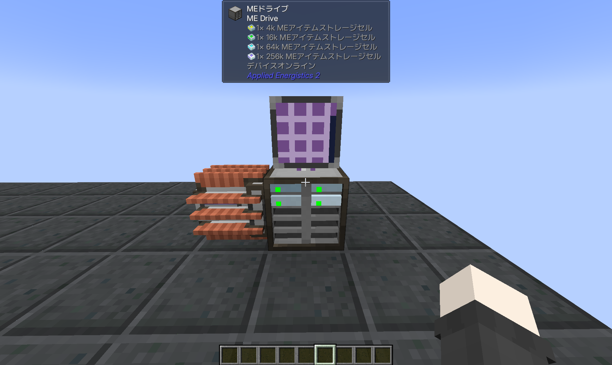

他MODの発電機を使用する場合は、追加で以下のアイテムが必要です:

エナジーアクセプター

受け取ったエネルギーを変換し、ネットワークへ供給します。

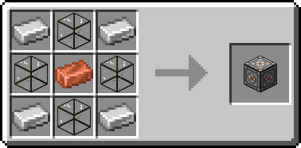

## RS: 手動クラフト

ネットワーク上のアイテムを用いて作業台クラフトを行うには、グリッドを以下のアイテムで置き換えてください:

クラフトグリッド

作業台機能が内蔵されたグリッドです。JEI/REI/EMIから直接レシピを配置できます。

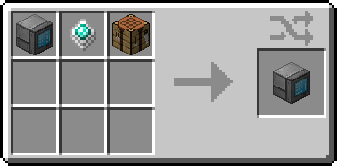

## AE2: 手動クラフト

ネットワーク上のアイテムを用いて作業台クラフトを行うには、MEターミナルを以下のアイテムで置き換えてください:

MEクラフトターミナル

作業台機能が内蔵されたMEターミナルです。RS同様に、JEI/REI/EMIから直接レシピを配置できます。

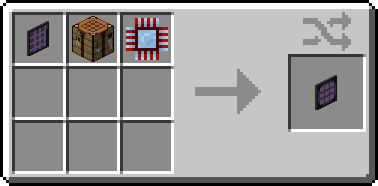

## RS: 自動作業台クラフト

Refined Storageで作業台クラフトを自動化するには、以下のアイテムが必要です:

パターン

レシピを保管します。

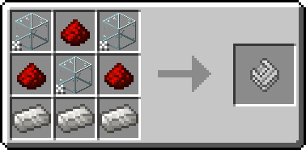

パターングリッド

レシピをパターンへ書き込みます。レシピビューアから直接書き込むこともできます。

精密モードがオフの場合、NBTは無視され、タグが共通の他アイテムを使用してクラフトを行うようになります。例えば、チェストの作成にどんな種類の木材でも使用できるようになります。

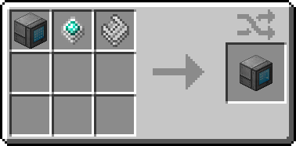

クラフター

登録されたパターン通りにアイテムをクラフトします。最大9個のパターンを挿入できます。

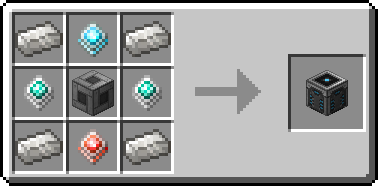

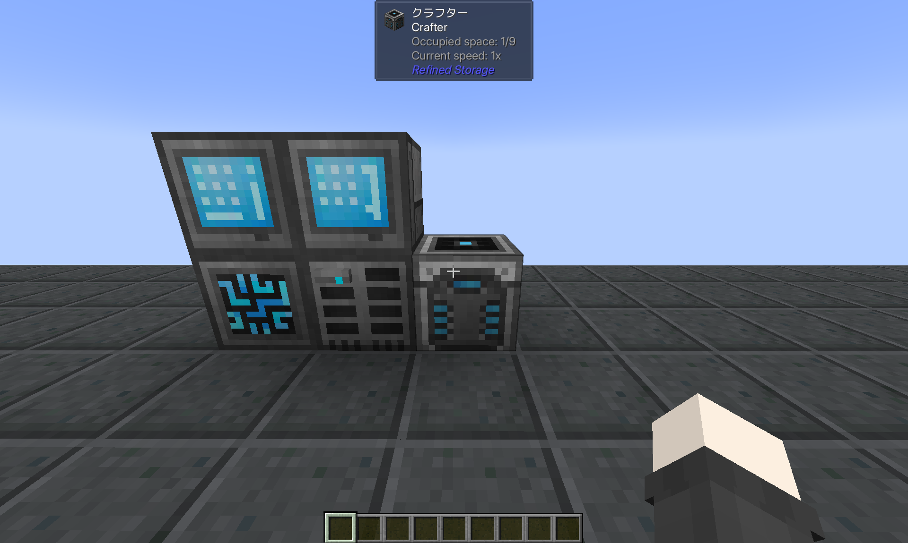

任意のグリッド上で`クラフト`と表記されたアイテムをクリックすることで、クラフトの発注を行えます。
既にネットワーク上に存在するアイテムを追加発注するには、アイテムを`Ctrl`+`Shift`+`クリック`してください。

## AE2: 自動作業台クラフト

AE2で作業台クラフトを自動化するには、以下のアイテムが必要です:

ブランクパターン

レシピを保管します。

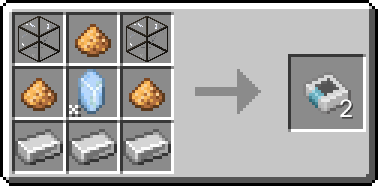

MEパターンエンコーディングターミナル

レシピをパターンへ書き込みます。同様に、レシピビューアから直接書き込むこともできます。

`置換有効`状態は、RSの精密モードに相当します。

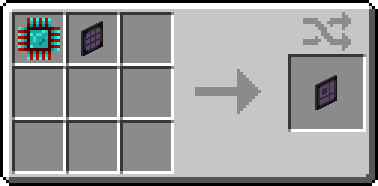

分子組立機

登録されたパターンに応じてアイテムを受け取り、クラフトを行います。パターンを1個だけ挿入できます。

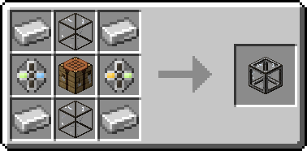

MEパターンプロバイダー

登録されたパターンに応じて、周囲の機械へアイテムを供給します。最大9個のパターンを挿入できます。

空の分子組立機に隣接させた場合、分子組立機を使用してクラフトを行い、成果物を自動で取り込みます。

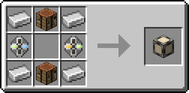

クラフティングストレージ

ネットワークの自動クラフトを担当するマルチブロック設備、**クラフトCPU**の構築に使用します。

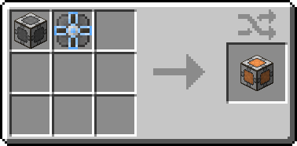

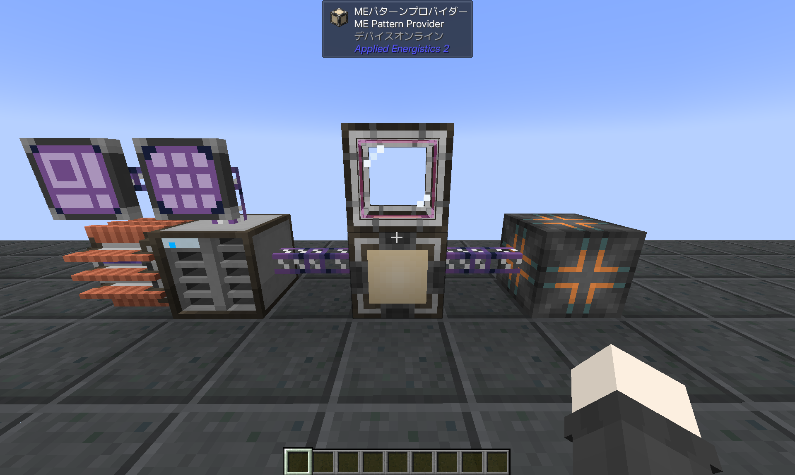

任意のMEターミナル上で`クラフト`と表記されたアイテムをクリックすることで、クラフトの発注を行えます。既にネットワーク上に存在するアイテムを追加発注するには、アイテムを`ミドルクリック`してください。

大きなストレージを持つクラフトCPUは、自動クラフトでたくさんのアイテムを取り扱うことができますが、1つのCPUが複数の自動クラフトを実行することはできません。複数の自動クラフトを発注するには、CPUを複数台用意してください。
